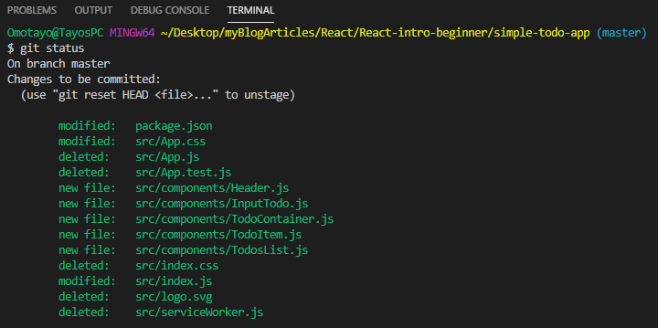
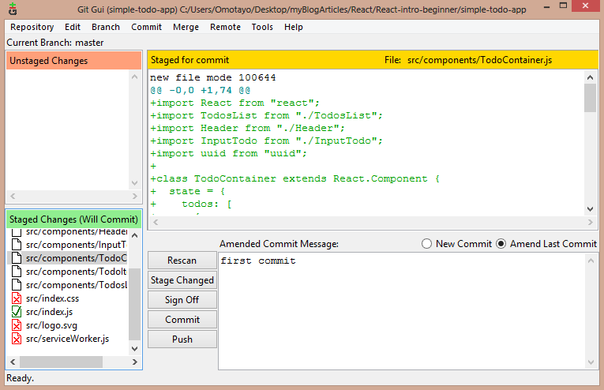
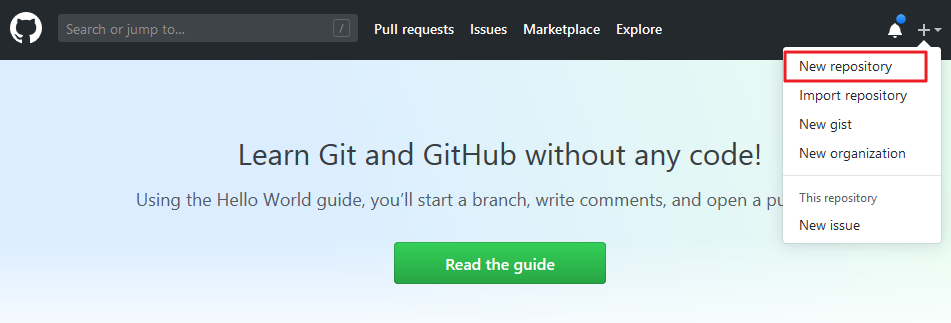
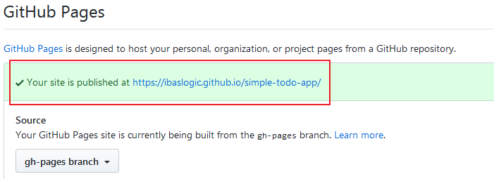

<PostSeriesLink
label="This React tutorial is part 4 of 6 in the React for beginners series."
datas={[
{
prefix: "Part 1",
label: "React Tutorial: The Beginner's Guide to Learning React in 2020",
url: "/blog/react-tutorial-for-beginners/"
},
{
prefix: "Part 2",
label: "Getting Started with React Form and Event Handling",
url: "/blog/react-form-handling/"
},
{
prefix: "Part 3",
label: "How to Implement CSS in Reactjs App",
url: "/blog/css-in-reactjs-app/"
},
{
prefix: "Part 5",
label: "Making HTTP Request in React and understanding the lifecycle methods",
url: "/blog/react-http-request-and-lifecycle-methods/"
},
{
prefix: "Part 6",
label: "The Practical Guide to Learning Hooks for Beginners",
url: "/blog/react-hooks-tutorial/"
},
]}
/>

Now that you have your beautiful app, it's time to share it with the world.

In this part, you will learn how to deploy your React application to GitHub pages and access it on the web.

> GitHub Pages is a static hosting service that takes HTML, CSS and JavaScript files straight from a repository on GitHub, optionally runs the file through a build process and publishes a website/app.

To get started, you need to have a [GitHub account](https://github.com/ "GitHub account sign up"). Also, make sure you have Git installed on your machine.

You can [download and install Git](https://git-scm.com/downloads "Git site") for your operating system and then, [set it up](https://www.atlassian.com/git/tutorials/install-git "Git installation guide").

Once that’s done,

You will need to move all your React code to your GitHub account. And this can be done in two phases.

First, you will move your files to the local repository and then to the remote repository.

Let’s get started.

Stop the server with `Ctrl + C`.

## Initialize the project folder as a Git repository

The first thing you would want to do when setting up a git project is to initialize your local Git repository. This will create a `.git` folder (hidden by default) in your project directory.

Fortunately, this is available by default when you set up a React project with `create-react-app` CLI.

> To see the `.git` folder, open your project directory if you are on Windows, go to the **View** tab and click on **Options** located at the top right side. This will pop up a new window. Next, click on **View** and then select **Show hidden files, folders, or drives** radio button under the **Advance settings**. Finally, uncheck **Hide extensions for known file types**.
>
> Click the **Apply** button and then **Ok**.

Now you should be able to see the `.git` folder in your project directory.

But if you do not set up your project with the CLI, run this command from your terminal to create it:

```
C:\Users\Your Name\simple-todo-app > git init
```

Make sure you are in your project directory in the terminal.

For the rest of us that set up the project using the `create-react-app` CLI, we don’t need to reinitialize the git repository.

Instead, we just have to make sure that all of the new files actually becomes part of the repo.

Let’s do that.

## Deploy to a local repository

From your terminal, run this command:

```
C:\Users\Your Name\simple-todo-app > git add .
```

This keeps all your working files in the staging area. Please don’t forget the dot `(.)`

> **Note:** The dot `(.)` indicates that you are adding all the files in the staging area and putting them in the local repository. If you want to add a specific file for instance `index.js`, you would run something like this:
>
> ```
> git add index.js
> ```

To see what is in the staging area, let's run this command:

```
C:\Users\Your Name\simple-todo-app > git status
```

This allows you to check the current status of the working tree. You'll have the files in green if they are in the staging area. Else, you'll have them in red.



Next, run this command to commit all the changes:

```
C:\Users\Your Name\simple-todo-app > git commit -m 'first commit'
```

> You specify your commit message within the quote. Modify to whatever suit you.

At this point, your project files are now in the local repository. To view them, open the Git GUI you installed in your machine. Click on the **Open Existing Repository** and then search for your project folder.

Open it and select the **Amend Last Commit** button to view your staged Changes.



Now, you are ready to push these files to the remote repository.

## Deploy to a remote repository

Go ahead and log into your GitHub account and create a new repository.



On the new page, you will be required to name your repository. In my case, I will name it **simple-todo-app**. Other fields are optional and self-explanatory.

> Note that React already included a `README.md` file in your project folder. So DON'T Initialize this repository with a README.

Once you are done, click on the **Create repository** button.

This takes you to a page where you will find additional information on what to do.

Find the command that looks like this and run it in your terminal:

```
git remote add origin https://github.com/Ibaslogic/simple-todo-app.git
```

If you can't find it, make sure you modify the URL above to reflect your repository.

What this command does is add the repo as the remote repository.

Finally, run this command to push to the master branch:

```
git push -u origin master
```

Now reload your GitHub page. You should have your project files and folders already pushed to your account.

We are almost done! Now we can publish our app to gh-pages.

## Deploy Todos app to Gh-pages

Back to the terminal, let’s install a package that will create a gh-pages branch on GitHub.

So run:

```
C:\Users\Your Name\simple-todo-app > npm install gh-pages
```

After that, open the `package.json` file in your root directory and add this line of code at the top level.

```json
"homepage": "https://username.github.io/repository-name",
```

Modify the above URL to include your GitHub username and repository name.

In my case, the `package.json` file now looks like this:

```json{4,6}
"name": "simple-todo-app",
"version": "0.1.0",
"private": true,
"homepage": "https://ibaslogic.github.io/simple-todo-app",
"dependencies": {
  "gh-pages": "^2.1.1",
  "react": "^16.11.0",
  "react-dom": "^16.11.0",
  "react-scripts": "3.2.0",
  "uuid": "^3.3.3"
```

Still in the `package.json` file. Locate the `scripts` property and add these lines of code:

```json
"predeploy": "npm run build",
"deploy": "gh-pages -d build"
```

Your scripts should look like this:

```json{6,7}
"scripts": {
"start": "react-scripts start",
"build": "react-scripts build",
"test": "react-scripts test",
"eject": "react-scripts eject",
"predeploy": "npm run build",
"deploy": "gh-pages -d build"
},
```

Save the file.

Lastly, run this command to push your file to the gh-pages:

```
C:\Users\Your Name\simple-todo-app > npm run deploy
```

This command will create a `build` folder in the root directory. This folder will contain production-ready files that will be deployed.

Once your app is successfully deployed, you can visit the URL you assigned to the `homepage` property in the `package.json` file and see your application.

Alternatively, you can go back to your GitHub repository and click on the **Settings** tab. Then scroll down to **GitHub pages** section to see the URL.



Congratulations!

Test your application and proudly share with the world.

## Conclusion

So much have been covered in this React for beginner’s series. Now you know what React is, how to create a beautiful React application and deploy it on the web.

In the next part, I will walk you through how to connect your application to a remote endpoint and fetch data from an API.

Likewise, you will learn the React lifecycle methods.

So far, I hope you feel more confident learning React through the series?

As usual, endeavour to share this article around the web.

If something wasn't clear, do let us know.

Again, here is the [React application](https://ibaslogic.github.io/simple-todo-app/ "simple react app") and the [source code](https://github.com/Ibaslogic/simple-todo-app "simple react app GitHub repo").

<PostSeriesLink
label="This React tutorial is part 4 of 6 in the React for beginners series."
datas={[
{
prefix: "Part 1",
label: "React Tutorial: The Beginner's Guide to Learning React in 2020",
url: "/blog/react-tutorial-for-beginners/"
},
{
prefix: "Part 2",
label: "Getting Started with React Form and Event Handling",
url: "/blog/react-form-handling/"
},
{
prefix: "Part 3",
label: "How to Implement CSS in Reactjs App",
url: "/blog/css-in-reactjs-app/"
},
{
prefix: "Part 5",
label: "Making HTTP Request in React and understanding the lifecycle methods",
url: "/blog/react-http-request-and-lifecycle-methods/"
},
{
prefix: "Part 6",
label: "The Practical Guide to Learning Hooks for Beginners",
url: "/blog/react-hooks-tutorial/"
},
]}
/>
