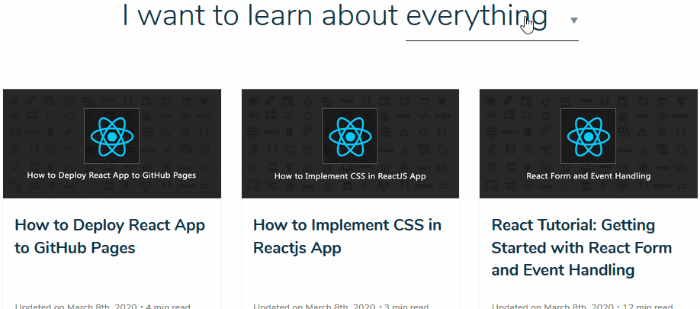
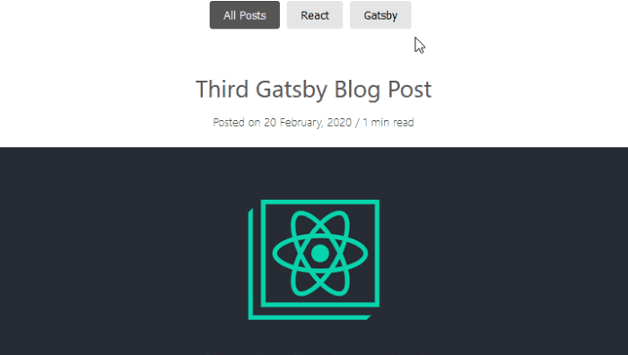
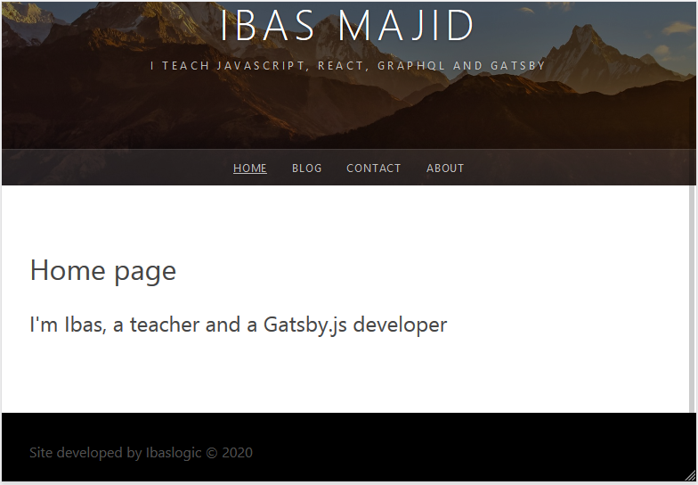
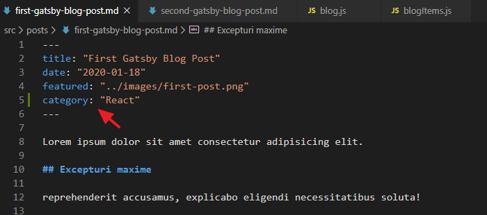
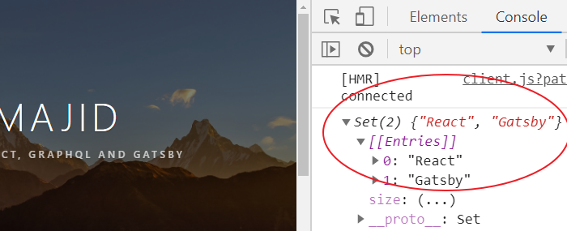
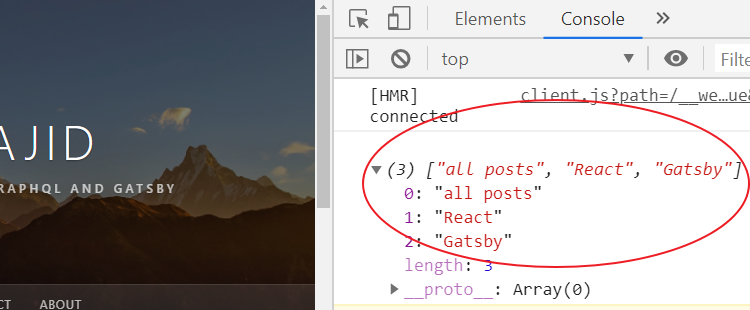
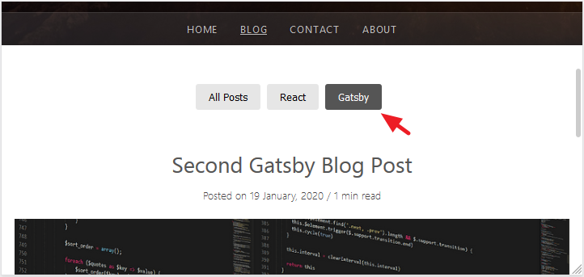

Oftentimes, I get asked by my readers how they can implement the instant post switching as seen on my blog page.

As a site owner, providing your audience with the ease to interact with your post is something you’d want to prioritize.

Take a look at this.

<br />



If you love the fluidity of the post type switching and think of applying that to your Gatsby site, then this guide is for you.

But instead of the dropdown type of post-filtering as seen on the blog page, we will be creating the filtering button to switch the posts in this tutorial.

This is what we [will create at the end of this tutorial](https://gatsby-post-switching.netlify.com/blog/ "Ibaslogic post switching").

<br />



The approach is the same. You can use your CSS skills to make it a dropdown.

Or simply take a look at [my site code on GitHub](https://github.com/Ibaslogic/Ibaslogic "Ibaslogic github project") and see how I created the dropdown.

## Prerequisite

To follow this tutorial, make sure you are comfortable creating a Gatsby site. If not, quickly read this [Gatsby tutorial guide](/blog/gatsby-tutorial-from-scratch-for-beginners/ "gatsby tutorial") and come back.

You can as well follow along if you want to apply this feature in your [React application](/blog/react-tutorial-for-beginners/ "react tutorial").

We will be writing purely React code!

You just have to understand how it works. You can easily tweak the code to suit your needs.

<br />

Enough said. Let’s dive in.

## Setting up a Gatsby Starter

Just like every Gatsby site, we will start by installing a [Gatsby starter](https://www.gatsbyjs.org/starters/ "gatsby starters").

Any Gatsby blog starter will do. But in this guide, I’ve provided a [Gatsby starter to use](https://github.com/Ibaslogic/ibaslogic-gatsby-tutorial "ibaslogic gatsby starter").

Install it by running this command from your terminal:

```
gatsby new gatsby-post-switching https://github.com/Ibaslogic/ibaslogic-gatsby-tutorial
```

Once you have the project files and folders bootstrapped, switch inside the directory (`cd gatsby-post-switching`) and run the development server.

```
C:\Users\Your Name\ gatsby-post-switching > gatsby develop
```

Now, you should have your default home page at http://localhost:8000

<br />



Good.

<br />

**_Before you get started, here is what you need to know._**

<br />

Irrespective of the Gatsby blog starter you are using, you’d want to use the **page query** to grab your data from the source (either [from the filesystem](/blog/gatsby-tutorial-from-scratch-for-beginners/ "gatsby tutorial") or [Content Management System](/blog/gatsby-with-contentful-cms/ "gatsby tutorial contentful")) instead of the **StaticQuery**.

The reason for that is because you can easily pass all the query data (in this case, a list of posts) into a child component so that your blog page file will not be cumbersome.

The starter template we are using in this tutorial uses the **StaticQuery** to grab the data.

It was intentional.

This will allow you to learn how to convert static query to page query. And we will start with that.

Once this child component receives the query data (i.e a list of posts) from the blog page component, we will store them in the state so that we can filter and update them.

To do this, we will make the component a **class-based**.

> Note that we can also manage the state logic through the **functional component** by [using the React Hooks](/blog/react-hooks-tutorial/ "React Hooks tutorial").

<br />

Ok. Let’s get started.

We will start by converting the blog page to use the page query.

In the `src/pages/blog.js` file, cut the static query and paste it outside of the component definition (preferable after the `export default` at the bottom). Make sure you modify it to use the page query like so:

```js
export const query = graphql`
  query {
    allMarkdownRemark(sort: { fields: frontmatter___date, order: DESC }) {
      edges {
        node {
          frontmatter {
            title
            date(formatString: "DD MMMM, YYYY")
            featured {
              childImageSharp {
                fluid(maxWidth: 750) {
                  ...GatsbyImageSharpFluid
                }
              }
            }
          }
          timeToRead
          excerpt
          id
          fields {
            slug
          }
        }
      }
    }
  }
`
```

At this point, the result coming from the query is injected into the component through the `props`. From there, we can access the `data` like so:

```js
const Blog = ({ data }) => {
```

And now we can pass it down to a child component.

If you save your file, your code will still work!

That’s all for the conversion.

Now, we can create a child component where we will pass the query data. From there, we can manage the post switching and render them on the screen.

In the `src/components` folder, create a file called `blogItems.js`. Inside this file, add the following starting code:

```jsx
import React, { Component } from "react"
import { Link } from "gatsby"

import Img from "gatsby-image"
import blogStyles from "../pages/blog.module.scss"

class BlogItems extends Component {
  state = {
    items: this.props.items.allMarkdownRemark.edges,
    blogPostItems: this.props.items.allMarkdownRemark.edges,
  }
  render() {
    return (
      <ul className={blogStyles.posts}>
        {this.state.blogPostItems.map(edge => {
          return (
            <li className={blogStyles.post} key={edge.node.id}>
              <h2>
                <Link to={`/blog/${edge.node.fields.slug}/`}>
                  {edge.node.frontmatter.title}
                </Link>
              </h2>
              <div className={blogStyles.meta}>
                <span>
                  Posted on {edge.node.frontmatter.date} <span> / </span>{" "}
                  {edge.node.timeToRead} min read
                </span>
              </div>
              {edge.node.frontmatter.featured && (
                
              )}
              <p className={blogStyles.excerpt}>{edge.node.excerpt}</p>
              <div className={blogStyles.button}>
                <Link to={`/blog/${edge.node.fields.slug}/`}>Read More</Link>
              </div>
            </li>
          )
        })}
      </ul>
    )
  }
}

export default BlogItems
```

You can start by cutting the post loop from within the `return` statement of the blog page into the `BlogItems` component and then modify.

Then, update the `src/pages/blog.js` file to include a reference to this component.

```jsx{6,15}
import React from "react"
import { graphql } from "gatsby"

import Metadata from "../components/metadata"
import Layout from "../components/layout"
import BlogItems from "../components/blogItems"

const Blog = ({ data }) => {
  return (
    <Layout>
      <Metadata
        title="Blog"
        description="This is where I write about my expertice"
      />
      <BlogItems items={data} />
    </Layout>
  )
}

export default Blog

export const query = graphql`
  query {
    allMarkdownRemark(sort: { fields: frontmatter___date, order: DESC }) {
      edges {
        node {
          frontmatter {
            title
            date(formatString: "DD MMMM, YYYY")
            featured {
              childImageSharp {
                fluid(maxWidth: 750) {
                  ...GatsbyImageSharpFluid
                }
              }
            }
          }
          timeToRead
          excerpt
          id
          fields {
            slug
          }
        }
      }
    }
  }
`
```

At this point, we can start working on the post switching.

Notice we declared two parameters (`items` and `blogPostItems`) of the same value in the state. Both of which contains all of the blog posts in the `edges` array.

However, we are looping through the `blogPostItems` within the `render()` method to display the list of posts.

The trick is simple!

If the user clicks on the **All Posts** button, we will reset the `blogPostItems` in the state back to the `items` (which contain also all of the original posts).
Else, if any of the categories buttons is clicked, we will filter the `items` and pass it to the `blogPostItems`.

Make sense?

As you just read, we will be using the post categories for switching.

So let’s start by adding the `category` field to the `frontmatter` of every post.



In my case, I’ve created another blog post making it three. Then I added “Gatsby” and again “React” to the other two posts.
You will see why I did that in a moment.

> **Note:** If you are getting the content from CMS like Contentful, go there and add the category to the Content model. You can [check this guide](/blog/gatsby-with-contentful-cms/ "gatsby contentful") for easy setup.

Next, update the blog page query to include the `category`.

```js{6}
export const query = graphql`
  query {
    ...
      frontmatter {
        title
        category
        date(formatString: "DD MMMM, YYYY")
        featured {
          childImageSharp {
            fluid(maxWidth: 750) {
              ...GatsbyImageSharpFluid
            }
          }
        }
      }
    ...
  }
`
```

Now, we will set up a function that will grab these categories for us.

Above the class component in the `blogItems.js` file, add the following code:

```js
const getCategories = items => {
  let categoryItems = items.map(item => {
    return item.node.frontmatter.category
  })
  return categoryItems
}
```

Then call this function within the state.

```js
state = {
  items: this.props.items.allMarkdownRemark.edges,
  blogPostItems: this.props.items.allMarkdownRemark.edges,
  categories: getCategories(this.props.items.allMarkdownRemark.edges),
}
```

As you have noticed, we are passing the `edges` array (which contains all of the post data) to the `getCategories` function, which we then looped through to get the individual post category.

To see the result through the console, add this line immediately inside the `render()` method.

```js
console.log(this.state.categories)
```


As you can see, we are getting repeated categories. That’s not what we want.

We want unique categories.

> This is why I advise adding more post of the same category to show you how things work.

We will use JavaScript `Set` object to make the repeated category only occur once.

So update the function so you have:

```js
const getCategories = items => {
  let categoryItems = items.map(item => {
    return item.node.frontmatter.category
  })
  let uniqueCategories = new Set(categoryItems)
  return uniqueCategories
}
```

Refresh the blog page and check the console of your DevTools.



Now, we are getting the unique categories.

However, it is returning an object instead of array (which is easier to work with).

So let’s quickly convert it to an array and then add “all posts” value to the list. This is necessary to create the “all posts” button for the users to view all of the posts.

Go back in your code and update the function so you have:

```js
const getCategories = items => {
  let categoryItems = items.map(item => {
    return item.node.frontmatter.category
  })
  let uniqueCategories = new Set(categoryItems)
  let categories = Array.from(uniqueCategories)
  categories = ["all posts", ...categories]
  return categories
}
```

Save your file.

Now if you reload the page and check the console once again, the returned data should be an array.



> Notice that we used the spread operator (the three dots, `...`) to unpack the elements of the `categories` array.

Don’t forget to remove the `console.log` you added earlier.

Moving on…

Let’s display the post-switching buttons.

In your `blogItems.js` file, add this code just after the `<ul>` opening tag in the `return` statement.

```jsx
<div className={blogStyles.filterButton}>
  {this.state.categories.map((category, index) => {
    return (
      <button type="button" key={index}>
        {category}
      </button>
    )
  })}
</div>
```

If you are using another Gatsby template, just make sure you add the code in the wrapper element inside the `return` statement.

> Notice we are using the CSS modules to style the component. So adjust if you are using the regular CSS.

Ok.

Add the following CSS styles in the `src/pages/blog.module.scss` file:

```css
// post filter button

.filterButton {
  display: flex;
  justify-content: center;
  margin-bottom: 40px;
}

.filterButton button {
  padding: 0.5rem 1rem;
  margin-right: 0.5rem;
  margin-bottom: 0.5rem;
  border-radius: 3px;
  background: #e6e6e6;
  border: none;
  color: #040404;
  text-transform: capitalize;
  cursor: pointer;
}

.filterButton button:hover {
  background: #555;
  color: #fff;
}
```

Save your files and check the blog page. You should have the buttons display.

Great! We are almost there.

## Adding functionalities to the Post filtering buttons

I mentioned earlier that anytime the user clicks on the **All Posts** button, we will reset the `blogPostItems` in the state back to the `items`. Else, we will filter the `items` based on the category clicked and pass it to the `blogPostItems`.

Let’s see how to achieve this.

We will start by adding an `onClick` event to the `button` element.

```jsx
<button type="button" key={index} onClick={() => this.handleItems(category)}>
  {category}
</button>
```

Then add the `handleItems` method above the `render()` method:

```js
handleItems = category => {
  console.log(category)
}
```

For the meantime, we are logging the category that is being clicked in the console.

Save the file.

Open the DevTools console and click any of the filter buttons. You should see its category rendered.

Instead of that, let’s switch the posts based on these categories.

Update the `handleItems` method so you have:

```js
handleItems = category => {
  if (category === "all posts") {
    this.setState({
      blogPostItems: [...this.state.items],
    })
  } else {
    this.setState({
      blogPostItems: [
        ...this.state.items.filter(edge => {
          return edge.node.frontmatter.category === category
        }),
      ],
    })
  }
}
```

Save the file and test your work.

And it works!

Good job.

<br />

**What is happening in the code?**

<br />

We started by getting a copy of all the post items using the spread operator (`…`). Then, we are using this copy to reset the rendered posts based on the condition (`if-else` statement).

> **Note:** With the `filter()` method, we are saying that for each of the post items that we are looping through, we want to retain the once that the category matches the one passed in.

<br />

Finally, let’s style the active category button for the rendered post.

Start by adding another property, `selectedItem` to the `state` object.

```js
selectedItem: getCategories(this.props.items.allMarkdownRemark.edges) && getCategories(this.props.items.allMarkdownRemark.edges)[0],
```

Here, we are setting the first item of the array to be the default button that will get styled. As you know, it is the “all posts” item.

Then update the button element to include the `style` prop.

```jsx
<button
  type="button"
  key={index}
  onClick={() => this.handleItems(category)}
  style={this.state.selectedItem === category ? activeButtonClass : null}
>
  {category}
</button>
```

Here, we are using the **ternary operator** (which is an inline if-statement) in the `style` attribute to dynamically apply a style to the selected button.

And here is the style. Add it outside of the component (either above the class component or just before the `export default`).

```jsx
const activeButtonClass = {
  backgroundColor: "#555",
  color: "#fff",
}
```

Next, update the `setState()` methods to include this:

```js
selectedItem: category,
```

You should have:

```js
handleItems = category => {
  if (category === "all posts") {
    this.setState({
      blogPostItems: [...this.state.items],
      selectedItem: category,
    })
  } else {
    this.setState({
      blogPostItems: [
        ...this.state.items.filter(edge => {
          return edge.node.frontmatter.category === category
        }),
      ],
      selectedItem: category,
    })
  }
}
```

With these additions, if any of the category buttons is clicked, the state will receive the new category value and the CSS style will get applied.

Save your files and check the blog page.



Good job.

## Conclusion

With this simple implementation in your site, you will no doubt improve the user's experience by making it easier for them to navigate through your posts.

And the way we set this up, if you add more categories through your posts, more buttons will be displayed.

That’s what we want.

I hope you find this interesting. Should in case you encounter any difficulties, feel free to check [the source code on GitHub](https://github.com/Ibaslogic/gatsby-post-switching "project code"). And if you want to go further by implementing a dropdown, check my [site code as well on GitHub](https://github.com/Ibaslogic/Ibaslogic "Ibaslogic github project").

[The project](https://gatsby-post-switching.netlify.com/blog/ "Ibaslogic post switching").

Your turn!

Make sure you follow our social pages to get the latest updates, subscribe and endeavour to share this post.
