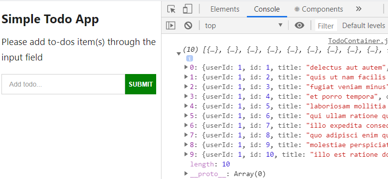
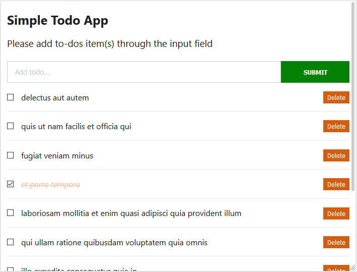
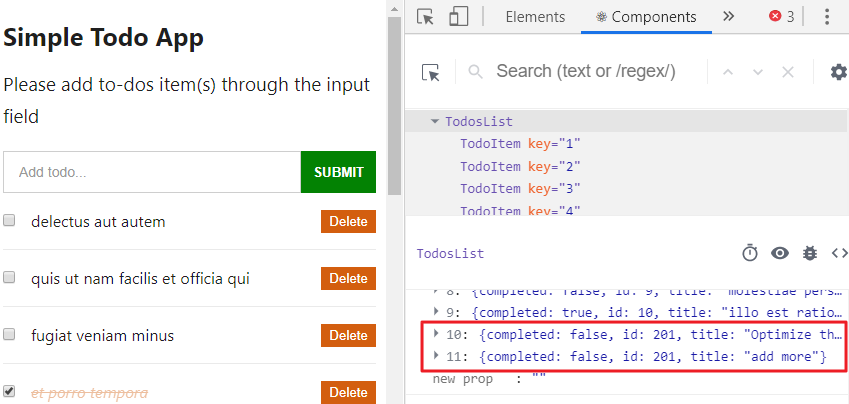
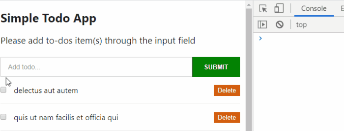
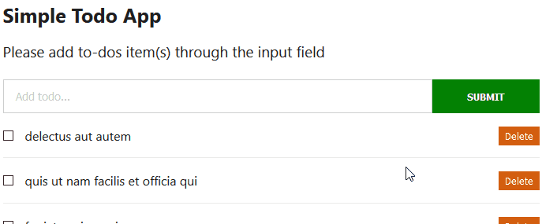

<PostSeriesLink
label="This React tutorial is part 5 of 6 in the React for beginners series."
datas={[
{
prefix: "Part 1",
label: "React Tutorial: The Beginner's Guide to Learning React in 2020",
url: "/blog/react-tutorial-for-beginners/"
},
{
prefix: "Part 2",
label: "Getting Started with React Form and Event Handling",
url: "/blog/react-form-handling/"
},
{
prefix: "Part 3",
label: "How to Implement CSS in Reactjs App",
url: "/blog/css-in-reactjs-app/"
},
{
prefix: "Part 4",
label: "Deploying React App to GitHub Pages",
url: "/blog/deploying-react-app-to-github-pages/"
},
{
prefix: "Part 6",
label: "The Practical Guide to Learning Hooks for Beginners",
url: "/blog/react-hooks-tutorial/"
},
]}
/>

In the last part of our React series, we deployed our working [todos app on the web](https://ibaslogic.github.io/simple-todo-app/ "dev server").

Up to this moment, we have the default todos items hardcoded in the app component.

While that’s fine, in reality, making an HTTP request or fetching data from an API is most likely what you’ll be doing when building an application with a frontend framework.

So instead of manually adding these default items, we will request the todos data from the server and list them on the frontend.

To do this, we can make use of the native Fetch API or Axios to perform this HTTP request to a REST API.

<br />

HTTP request? Native Fetch API? Axios? REST API?

<br />

What are they?

<br />

**An HTTP request** is a packet of information that one computer (client) sends to another computer (server) to convey something. Once the message is received by the server, a response is expected by the client.

**The Native Fetch API** allows us to perform an HTTP request to a server and handle responses. **Axios**, on the other hand, is a 3rd party HTTP library that allows us to make this request as well.

In this tutorial, we will make use of Axios to fetch a list of todos data.

One of the benefits of using this library over the native Fetch API is that it supports all modern browsers, including support for IE8 and higher by default. This is because it is compiled with Babel.

For Fetch API to support older browsers, it needs what is called polyfill – a piece of code used to provide modern functionality on older browsers.

Finally, understanding the **REST API** is necessary if you want to get data from another source on the internet. In our case, we will be getting a piece of data (a list of todos) when we link to a specific URL endpoint.

We will make use of a FREE online REST API called JSONPlaceholder. This allows us to mimic a real live server and have a backend to work with. From there, we can get a list of fake todos items into our Todos app.

Enough said. Let’s dive in.

First, you need to start your server by running `npm start`. After that, delete all the hardcoded todos data in the `TodoContainer` component.

The `state` object now looks like this:

```js
state = {
  todos: [],
}
```

Save the file and you’ll see your app displaying empty default items.

Next, head over to [JSONPlaceholder website](https://jsonplaceholder.typicode.com "jsonplaceholder site"). Scroll down to **Resources** section and click on the **todos** link. Here, you will see a list of 200 todos that we will be working with.

> Please take note of the URL, we will make an HTTP request to use its todos data.

But before that, we will need to install Axios to perform this request.

So stop the server with `CTRL + C` and run this from your terminal:

```
C:\Users\Your Name\simple-todo-app > npm i axios
```

Now, to start making this request, you’ll need to understand the lifecycle methods.

## The Lifecycle methods

Every React component you create always goes through a series of events or phases from its birth to death. For instance, if you create a component to render something on the screen, it will go through a couple of phases to display the content.

You can think of this component going through a cycle of birth, growth and finally death.

In React, these phases are mainly three:

**Mounting** – As the name implies, this is the phase when React component mounts (created and inserted) the DOM. In this phase, the component is birthed.

**Updating** – Once the component is mounted, next is to get updated if necessary. Remember that component gets updated when there is/are state or prop changes, hence trigger re-rendering. All of that happens in this phase.

**Unmounting** – This phase ends the component lifecycle because, in it, the component is removed from the DOM.

In each of these phases, React provides lifecycle methods that we can use to monitor and manipulate what happens within the component.

Though, we have been using one of these lifecycle methods – the `render()` method.

This method is the only required lifecycle method within a React class component. It’s responsible for rendering React elements in the DOM and it is called during the mounting and updating phase.

React has several optional lifecycle methods, of which some are deprecated. But the common once include –

**componentDidMount()** – This method is called after the component is rendered.

**componentDidUpdate()** – This is called immediately after updating occurs.

**componentWillUnmount()** – This is called immediately before a component is unmounted or destroyed.

### The componentDidMount() method

As a beginner, you will most likely be working with the `componentDidMount()` in addition to the `render()`lifecycle method. This is because, most of the time, you will be making an HTTP request. And one of the common uses of this lifecycle method is to get data from somewhere.

Remember, we want to load todos data from a remote endpoint. So, the `componentDidMount()` method is a good place to make this type of HTTP request. This ensures that your data is fetched as soon as possible.

So let's apply this method. Start your development server with `npm start`.

### Making a GET request

As expected, we use the `Get` HTTP method to fetch data. So, let’s start by importing the Axios library in the `TodoContainer`.js file:

```
import axios from "axios";
```

Then add the following code above the `render()` method in the `TodoContainer` component:

```js
componentDidMount() {
  axios.get("https://jsonplaceholder.typicode.com/todos")
    .then(response => console.log(response.data));
}
```

Save the file and check the console. You will see a list of objects containing the todos data.

> Make sure you are connected to the internet.

We can limit the number of todos data to 10 just for brevity.

This can be done either by appending the query string parameter `\_limit=10` to the URL or by adding them as a second argument in the `get()` method.

I will show you both options.

First, update the endpoint URL so you now have this:

```js
axios.get("https://jsonplaceholder.typicode.com/todos?_limit=10")
```

Save the file and go back to the console. You should see the todos data limited to 10.



The second option is to add a config object as the second parameter in the `get()` method like so:

```js
componentDidMount() {
  axios.get("https://jsonplaceholder.typicode.com/todos", {
      params: {
        _limit: 10
      }
    })
    .then(response => console.log(response.data));
}
```

You should have the same result as the first method.

Here we are using the `params` option to set a query string parameter in the config object.

To be on the same page, let’s go with the first method.

Before we go ahead and display the todos items in our app, let’s explain what we did.

First, I guess you remember why we are using the `componentDidMount()` method. Again, it is a good place to make an HTTP request.

Here, we are using HTTP `GET` method to retrieve data from an endpoint.

By using Axios, we make use of `axios.get()` method. This accepts the URL of the endpoint and an optional config object as the second parameter.

This method, `axios.get()` returns a promise which must be resolved to access the data. To do that, we use the `.then()` method which will receive a response that contains the data we need.

Now, we can update the state with these data.

Update the code so you have:

```js
componentDidMount() {
  axios.get("https://jsonplaceholder.typicode.com/todos?_limit=10")
    .then(response => this.setState({ todos: response.data }));
}
```

Save the file and see the update in the frontend.



Thanks to the `setState()` call. React knows that the `todos` have changed from the empty data we assigned in the state to the data we received from the JSONPlaceholder API. It then calls the `render()` method once again to display the new data.

As you can see, some are marked as completed because they are assigned a `true` value. You can visit the endpoint URL in your browser and see what is assigned to each of the completed keys.

### Making a POST request

Now if you add more entries to the todos list, you will only be updating the UI and not the backend. What we want is to make a `POST` request to the API server, get a response and update the UI.

If you check the JSONPlaceholder home page, you will see a number of the request you can make under the **Routes** section. For instance, you can make a `POST` request, `DELETE` request and so on.

You would want to make a `POST` request whenever you are adding something.

Remember, we are working with a Fake Online REST API, so our data doesn’t actually get saved to the JSONplaceholder server. However, it does complete the request and gives us a response. Thereby mimics a real-life backend.

Now, let’s modify the `addTodoItem` method in the `TodoContainer` component so you have:

```js
addTodoItem = title => {
  axios
    .post("https://jsonplaceholder.typicode.com/todos", {
      title: title,
      completed: false,
    })
    .then(response =>
      this.setState({
        todos: [...this.state.todos, response.data],
      })
    )
}
```

Save the file.

When you make a `POST` request to the JSONplaceholder server, an `id` is generated for the returned data. So, you don’t need the `UUID` anymore. You can delete it.

However, this `id` is static for every submission. This is because we are not actually updating their database.

As seen below, it returned an `id` of 201 for every submission. Remember, the endpoint has a total of 200 todos items.



As expected, React will throw a console warning expecting a unique key. This will not be the case if you are working with a real server. Obviously, the next `id` will be 202 and so on.

With that out of the way, what exactly is happening in the code?

Unlike the `axios.get()` where the second parameter (config object) is optional. Here, it is required because it will contain the data that you want to send. Together with the todos `title`, we are assigning `false` value to the `completed` property so that a new entry by default will not be checked.

The `axios.post()` will also return a promise which must be resolved using the `.then()` method. The data it receives from its response is appended to the todos list as seen in the `setState()` method.

### Making a Delete Request

At this point, you should be comfortable making a request to the server. They all follow the same pattern. And a `DELETE` request is not an exception.

Let’s do it together.

Modify the `delTodo` method in the `TodoContainer` component so it looks like this:

```js
delTodo = id => {
  axios
    .delete(`https://jsonplaceholder.typicode.com/todos/${id}`)
    .then(reponse =>
      this.setState({
        todos: [
          ...this.state.todos.filter(todo => {
            return todo.id !== id
          }),
        ],
      })
    )
}
```

Save the file and test your application by deleting any of the todos item(s) on the list.

To make a `DELETE` request, you need not only the URL but also the `id` of the item to delete. Fortunately, we have the `id` as received in the function argument. And in JavaScript, we can insert dynamic expression (in our case, the `id`) within a string using the back-tick (` `` `).

Now, if you delete any item from the list, you will get a response from the virtual server and the UI get updated.

> Notice that you can only add or delete items if you have internet access. This shows there is a communication between the client and the backend.

Again, if you are working with a real backend, the todos item(s) will be deleted from the database and then update the UI.

### The componentDidUpdate() method

This is another important lifecycle method in React. As I mentioned earlier, this method is called immediately after updating occurs – i.e after state or props changes.

It is a perfect place to manipulate the DOM when the component has been updated. Also, in this method, you can make API calls after specific conditions have been met.

So let see how we can apply this method in our todos application.

First, what do we want to achieve?

We want a situation whereby when we click on the checkboxes, a text with random background colour is displayed in the header of our app.


<br />

How can we achieve this?

We will define another property in the `state` object of the parent component, `TodoContainer`, assign a default boolean value and pass it down to the `Header` component through props. Once this prop changes as a result of a clicked checkbox, this lifecycle method will be called and execute whatever we want.

Let’s see it in practice.

We’ll start by converting the `Header` component from function to class component. This is necessary since this component will manage the lifecycle logic.

> In the next part, you will learn how you can manage the state and lifecycle logic in a function component with React Hooks.

For now, update the `src/components/Header.js` file so you have:

```jsx
import React, { Component } from "react"

class Header extends Component {
  render() {
    const headerStyle = {
      padding: "20px 0",
      lineHeight: "2em",
    }
    return (
      <header style={headerStyle}>
        <h1 style={{ fontSize: "25px", marginBottom: "15px" }}>
          Simple Todo App <span id="inH1"></span>
        </h1>
        <p style={{ fontSize: "19px" }}>
          Please add to-dos item(s) through the input field
        </p>
      </header>
    )
  }
}

export default Header
```

The conversion is pretty straight forward. Please note that we’ve added a `span` element to the `h1` heading. In there, we will display our text.

Now, add this lifecycle method just above the `render()` method:

```js
componentDidUpdate(prevProps, prevState) {
  // update logic here
}
```

This method accepts the previous props and state as parameters. These are simply the state and props before the update.

We can use them to check for updates by comparing them to the current snapshot which we can get through `this.state` or `this.props`.

At the moment, they are null. So we need to pass data to them.

We can either define a state in this `Header` component to get the `prevState` or pass down data via props from the parent component to get the `prevProps`.

As I mentioned earlier, we will define another property in the `state` object of the parent component and pass it down to the `Header` component.

With this, we will have access to the `prevProps`.

So, update the `state` to include the `show` property and pass it to the `<header />`.

```jsx{5,11}
...
class TodoContainer extends React.Component {
  state = {
    todos: [],
    show: false
  };
  ...
  render() {
    return (
      <div className="container">
        <Header headerSpan={this.state.show} />
        ...
      </div>
    );
  }
}
...
```

Save the file.

Now, we have access to the default data through the `headerSpan` prop in the `Header` component.

Next, update the lifecycle method so you have:

```js
componentDidUpdate(prevProps, prevState) {
  if (prevProps.headerSpan !== this.props.headerSpan) {
    console.log("props change");
  }
}
```

In the code, all we are doing is comparing the previous and current snapshot.

Remember, we want these changes to happen once we click the checkboxes.

So we need to get the current prop by updating the method that is called whenever we click on the input checkbox.

In the parent component, `TodoContainer`, update the `handleChange` method to include the `show` object property:

```js
handleChange = id => {
  this.setState({
    todos: this.state.todos.map(todo => {
      if (todo.id === id) {
        todo.completed = !todo.completed
      }
      return todo
    }),
    show: !this.state.show,
  })
}
```

As seen in the code, we are inverting the current value of the `show` property. This way, anytime you click on the checkbox, you’ll always get a negated value.

Once this happens, the `componentDidUpdate()` method compares these props and detect changes. It then executes whatever you define in it.

Let’s test it.

Save the file. Head over to the console and click on the checkboxes.



We are almost there.

Instead of logging text in the console, we want to manipulate the DOM.

Update the method so you have:

```js
componentDidUpdate(prevProps, prevState) {

  var x = Math.floor(Math.random() * 256);
  var y = Math.floor(Math.random() * 256);
  var z = Math.floor(Math.random() * 256);
  var bgColor = "rgb(" + x + "," + y + "," + z + ")";

  if (prevProps.headerSpan !== this.props.headerSpan) {
    document.getElementById("inH1").innerHTML = "clicked";
    document.getElementById("inH1").style.backgroundColor = bgColor;
  }
}
```

This is self-explanatory.

All we are doing is referencing the `span` element in the JSX and then add text and dynamic background colour.

Once again, test your application.


<br />

### The componentWillUnmount() method

This lifecycle method is called when a component is about to be destroyed or removed from the DOM. Most of the time, it is used to perform cleanups. For instance – cancelling the network request, removing event listeners.

In our todos app, we will use this method to trigger an alert when an item is about to be deleted from the todos list.

This is pretty straight forward.

Go inside the `src/components/TodoItem.js` file and add this code above the `render()` method:

```js
componentWillUnmount() {
  alert("Item about to be deleted!");
}
```

That’s all.

Whenever any of the todos items is about to be deleted, this method will be called and executed.

Save your file and test your work.



Good job.

## Conclusion

A quick recap. In this part of the series, you’ve learned how to make an HTTP request to a server endpoint, how you can handle responses and finally, how you can use the React lifecycle methods in your application.

At this point, you have accomplished a lot in this React series.

Now, you can start learning how to use the React Hooks to manage the state and lifecycle logic in a function component.

Before you head over to the next part, make sure you subscribe and share this article around the web.

<PostSeriesLink
label="This React tutorial is part 5 of 6 in the React for beginners series."
datas={[
{
prefix: "Part 1",
label: "React Tutorial: The Beginner's Guide to Learning React in 2020",
url: "/blog/react-tutorial-for-beginners/"
},
{
prefix: "Part 2",
label: "Getting Started with React Form and Event Handling",
url: "/blog/react-form-handling/"
},
{
prefix: "Part 3",
label: "How to Implement CSS in Reactjs App",
url: "/blog/css-in-reactjs-app/"
},
{
prefix: "Part 4",
label: "Deploying React App to GitHub Pages",
url: "/blog/deploying-react-app-to-github-pages/"
},
{
prefix: "Part 6",
label: "The Practical Guide to Learning Hooks for Beginners",
url: "/blog/react-hooks-tutorial/"
},
]}
/>
