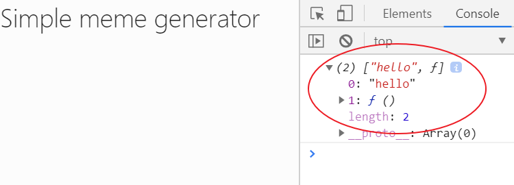

Earlier on this blog, we created a [practical guide to learning the React hooks](/blog/react-hooks-tutorial/ "react hook tutorial"). There, we discussed the fundamentals of these Hooks and also apply them in a real project.

You'd want to start with that if you are just getting started with React Hooks. In case you are not yet comfortable writing React code, you can follow this [step by step guide to React](/blog/react-tutorial-for-beginners/ "react tutorial").

That said. In this tutorial, we aim to solidify our React Hooks foundation by working on another simple project called meme generator.

If you are ready, let’s dive in.

### What is our goal?

We will be working with a simple meme generator app that is built on the class logic (state and lifecycle method). You will, however, learn how to manage this logic using the React Hooks in a function component.

Here is the [starter project](https://github.com/Ibaslogic/memegenerator "meme generator starter") for you to clone. So go ahead and clone it using this command.

```
git clone https://github.com/Ibaslogic/memegenerator
```

Once the download is done, change directory (`cd`) inside the project folder and run `npm install`. This creates a `node_module` folder consisting of the necessary dependencies.

Finally, start your server with `npm start`.

You should see this app at [http://localhost:3000/](http://localhost:3000/ "dev server")

<br />


<br />

What this app does is simple.

The user inputs the top and bottom text through the input fields and then generate random images by clicking on the `Generate` button.

As expected, you should know that the files that make up this UI live in the `src` folder. If you take a look inside the `src/components` folder, we have three files.

Both the `Header.js` and `MemeApp.js` are already a function component. The `MemeGenerator.js` manages the state and a lifecycle method, hence constructed using a class component.

Let’s optimize the component to use the React Hooks. So, open the `src/components/MemeGenerator.js` file.

Presently, it has a `state` object (consisting of four different properties with default values) and class methods including a lifecycle (`componentDidMount`) at the top level of the component.

You can start by commenting out all the code.

Then add this starting code at the top to avoid page break:

```jsx
import React from "react"

const MemeGenerator = () => {
  return <div></div>
}

export default MemeGenerator
```

This is our first conversion. As seen, we are now using a function to construct our component instead of class.

Next, let’s manage the state in this function component.

So, import the `useState` Hook from the `react` module like so:

```jsx{1,4}
import React, { useState } from "react"

const MemeGenerator = () => {
  console.log(useState("hello"))
  return <div></div>
}

export default MemeGenerator
```

Save the file.

You should know that the `useState` Hook will return an array containing two items. The current state and a function to update the state.



Recall from the [React Hooks for beginners’ guide](/blog/react-hooks-tutorial/ "react hooks tutorial"), we can destructure the returned value of this Hook to have access to its initial state (i.e default value) as well as a callback to modify it.

Something like this.

```js
const [topText, setTopText] = useState("hello")
```

Where `topText` holds the initial state i.e **hello** and the `setTopText` is a function to update the state.

If you apply this in the `MemeGenerator` component, you should have:

```jsx
import React, { useState } from "react"

const MemeGenerator = () => {
  const [inputText, setInputText] = useState({
    topText: "",
    bottomText: "",
  })
  const [randomImage, setRandomImage] = useState(
    "https://i.imgflip.com/26am.jpg"
  )
  const [allMemeImgs, setAllMemeImgs] = useState([])

  const handleChange = e => {
    setInputText({
      ...inputText,
      [e.target.name]: e.target.value,
    })
  }

  const handleSubmit = e => {
    e.preventDefault()
    console.log("submitted")
  }

  return (
    <div className="meme-container">
      <form onSubmit={handleSubmit}>
        <input
          type="text"
          name="topText"
          placeholder="Add Top Text"
          value={inputText.topText}
          onChange={handleChange}
        />
        <input
          type="text"
          name="bottomText"
          placeholder="Add Bottom Text"
          value={inputText.bottomText}
          onChange={handleChange}
        />
        <button>Generate</button>
      </form>
      <div className="meme">
        
        <h2 className="top">{inputText.topText}</h2>
        <h2 className="bottom">{inputText.bottomText}</h2>
      </div>
    </div>
  )
}

export default MemeGenerator
```

Save the file. You should see your app rendered in the frontend.

For now, if you click to generate new images, you’ll get a "submitted" text in the console of your browser DevTools.

What’s happening in the code?

Remember, in the class version, we declared a `state` object where we assigned default values to the object properties. But now, we are doing this using the `useState` React Hook.

Here, instead of defining all the properties in the `state` object, we have options to split them into multiple state Hook.

But take note, we are keeping related data (the `topText` and `bottomText`) together.

Now, we don’t have to use `this.state` to access the current state value. Instead, we are using their respective variables. Likewise, we are now updating the state using the second element returned by the `useState` Hook.

Also, take note of what’s happening in the `handleChange`. This function is called whenever the input text field changes.

You should know that anytime you are grouping related data in an object, the `useState` Hook doesn’t merge the old and new state. Instead, it overrides the entire state with that of the current.

To get a clearer picture,

For the meantime, comment-out the `…inputText` from the function so you have:

```js{3}
const handleChange = e => {
  setInputText({
    // ...inputText,
    [e.target.name]: e.target.value,
  })
}
```

Save your file and try to input the top and bottom text in your application.

You’ll notice that they are overriding each other.

So we merged them by passing the entire state using the spread operator (the three dots before `inputText`) and override the part of it.

> Please remember to uncomment the `…inputText` in the function.

Sometimes, manually merging the state might be cumbersome.

So an alternative is to split the `topText` and `bottomText` into different `useState` Hook. But in this case, you will need separate functions to manage the changes in these inputs.

This is not going to scale especially if you want to manage many input fields in your application.

Ok. Let’s move on.

### The useEffect React Hook

At the moment, if we click the `Generate` button in our app to display a random image, nothing will happen except that we are logging a simple text in the console.

If you take a look at the class version of the code, we are fetching these images using the fetch API in the `componentDidMount` lifecycle method.

And as you know, this method is not available in a function component.

So we will use another Hook called `useEffect`.

We have covered much of this in the [React Hooks guide](/blog/react-hooks-tutorial/ "react hook tutorial"), but to reemphasise, you can think of this Hook as `componentDidMount`, `componentDidUpdate`, and `componentWillUnmount` combined.

Let’s see how to apply it in our application.

Back in your `src/components/MemeGenerator.js` file, import `useEffect` Hook from the react module.

```js
import React, { useState, useEffect } from "react"
```

Then add this Hook above the `return` statement and save your file:

```js
useEffect(() => {
  console.log("test run")
  fetch("https://api.imgflip.com/get_memes")
    .then(response => response.json())
    .then(response => setAllMemeImgs(response.data.memes))
})
```

If you save the file and visit the console. You’ll see that this Hook is running infinitely.

What’s happening?

As you can see, this Hook accepts a function that defines the side effect to run. In our case, making HTTP request.

By default, it runs not only after the first render but also after every update – i.e when there is a prop or state changes.

In our code, a change occur. The `setAllMemeImgs` function updates its state variable when the data is fetched from the endpoint. Thereby causing the Hook to run continuously.

So, we have the responsibility to control it to the logic we want. Remember, we want to replicate the logic of the `componentDidMount` which should only run once it fetches data for the first time.

To do that, we will add an optional array of dependencies to the Hook so it looks like this:

```js
useEffect(() => {
  console.log("test run")
  fetch("https://api.imgflip.com/get_memes")
    .then(response => response.json())
    .then(response => setAllMemeImgs(response.data.memes))
}, [])
```

With this simple addition, the Hook now depends on the array of dependencies to re-run.

But in case there are no dependencies in the array as seen above, React will only execute the Hook once because no data is changing.

With this, you are safe to say that you have the equivalent of `componentDidMount` when you have an empty array as the second parameter.

Now, we can update the `handleSubmit` function.

```js
const handleSubmit = e => {
  e.preventDefault()
  const randNum = Math.floor(Math.random() * allMemeImgs.length)
  const randMemeImgUrl = allMemeImgs[randNum].url
  setRandomImage(randMemeImgUrl)
}
```

Save the file.

Comparing this code to that of the class version, you’ll notice that we’ve removed all the occurrence of `this.state` since it doesn’t apply in the function component. Likewise, the `setRandomImage` function which update its state value replaces `this.setState`.

Now check your app and test it.

It should work as expected.


Good job!

This is a quick one. I hope you are having fun learning these Hooks. All you need now is to practice as much as possible.

If you like this quick tutorial, feel free to share around the web and subscribe for more updates.

You can find the [source code here](https://github.com/Ibaslogic/React-Hooks/blob/master/src/components/MemeGenerator.js "meme generator source code").
